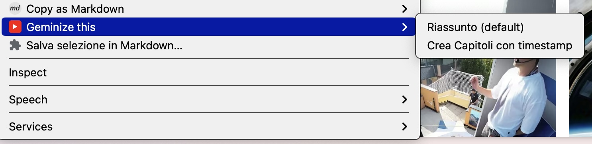
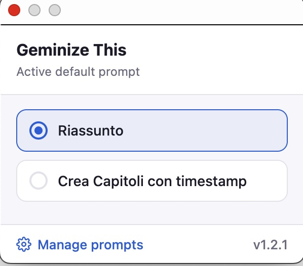
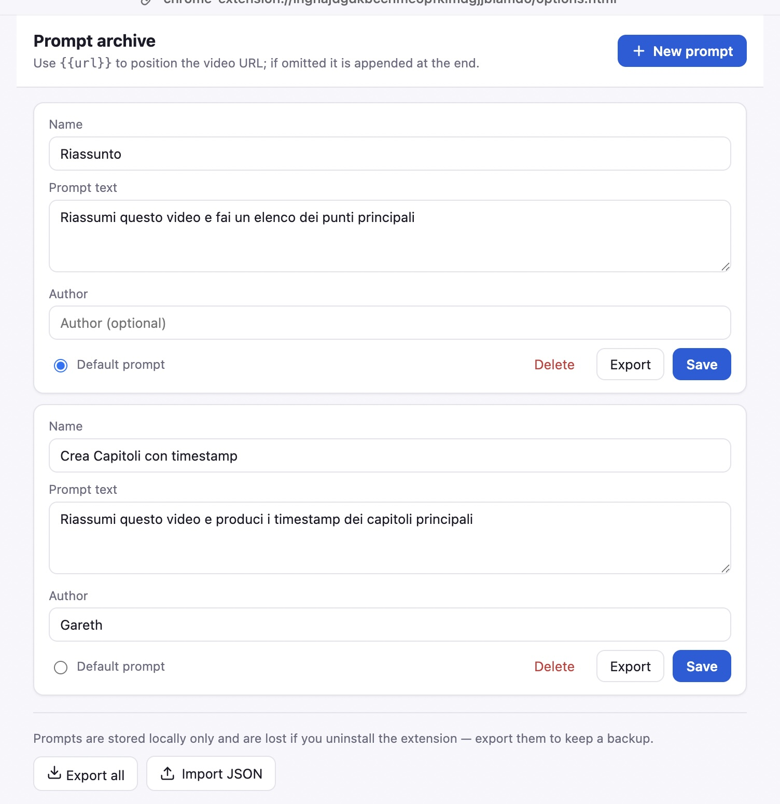

# Geminize This

🌐 [English](README.md) · **Italiano**

Un'estensione per Chrome che invia al volo i video di YouTube a Google Gemini
per riassumerli e analizzarli.

> Nota: l'interfaccia dell'estensione è in inglese. Questa è la documentazione
> in italiano del progetto.

## Screenshot

**Menu contestuale "Geminize this"** — clic destro su un link al video (o sulla
pagina del video) e scegli un prompt:

**Popup nella toolbar** — cambia rapidamente il prompt di default attivo:

**Archivio dei prompt** — crea, modifica, importa/esporta i prompt e imposta
quello di default:

## Come funziona

1.  **Menu contestuale**: l'estensione aggiunge il sottomenu "Geminize this" al
    menu del tasto destro. Compare sia quando fai clic destro su un link a un
    video di YouTube (ad esempio una miniatura nel feed) sia in un punto
    qualsiasi della pagina di un video, così puoi riassumere il video che stai
    già guardando. Il sottomenu elenca tutti i prompt salvati, con quello di
    default in cima.
2.  **Apertura**: cliccando un prompt si apre una nuova scheda su
    [gemini.google.com](https://gemini.google.com).
3.  **Inserimento**: uno *content script* sulla pagina di Gemini individua il
    campo di input tramite selettori DOM e vi inserisce automaticamente il
    prompt scelto insieme all'URL del video.

## Archivio dei prompt

Gestisci i prompt in locale (salvati nel browser tramite
`chrome.storage.local`, mai inviati ad alcun server):

*   **Pagina Opzioni**: apri le *Opzioni* dell'estensione
    (`chrome://extensions` → *Dettagli* → *Opzioni estensione*) per creare,
    modificare ed eliminare prompt e per impostare quello di default.
*   **Segnaposto `{{url}}`**: inserisci `{{url}}` ovunque nel testo di un prompt
    per decidere dove mettere l'URL del video; se manca, l'URL viene aggiunto in
    fondo.
*   **Default rapido**: clicca l'icona nella barra degli strumenti per cambiare
    il prompt di default da un popup.
*   **Campo autore**: ogni prompt ha un campo `author` facoltativo per
    l'attribuzione.
*   **Import / Export**: esporta tutti i prompt in un file JSON, oppure importa
    un file JSON di qualcun altro. L'import **unisce** (aggiunge) i prompt a
    quelli esistenti, così si possono condividere senza sovrascrivere i tuoi.

> **Fai il backup dei prompt.** I prompt vivono solo nel tuo browser
> (`chrome.storage.local`) e **vengono persi se disinstalli l'estensione**.
> Usa *Export all* nella pagina Opzioni per tenere un backup JSON e *Import*
> per ripristinarlo. (La sincronizzazione su account è in roadmap.)

## Installazione

### Per i beta tester (versione ZIP)
1.  Scarica l'ultimo `youtube2gemini-vX.Y.zip` dalle
    [release più recenti](https://github.com/garethjax/Geminizethis/releases).
2.  Estrai lo ZIP in una cartella sul tuo computer (la cartella estratta
    contiene già `manifest.json` nella radice — *è* l'estensione decompressa).
3.  Apri Chrome e vai su `chrome://extensions`.
4.  Attiva la **"Modalità sviluppatore"** (interruttore in alto a destra).
5.  Clicca **"Carica estensione non pacchettizzata"** e seleziona la cartella
    estratta.

### Per gli sviluppatori (versione clone)
1.  Clona questo repository.
2.  Apri Chrome e vai su `chrome://extensions`.
3.  Attiva la **"Modalità sviluppatore"** (interruttore in alto a destra).
4.  Clicca **"Carica estensione non pacchettizzata"** e seleziona la cartella
    `SOURCE` del progetto.

## Avvertenze importanti

### Dipendenza dal DOM
L'estensione si basa su selettori JavaScript specifici per trovare il campo di
input su Google Gemini. **Se Google modifica drasticamente la struttura
DOM/HTML di Gemini, l'estensione potrebbe non riuscire a inserire il prompt.**
In tal caso sarà necessario aggiornare i selettori nel content script.

### Nota sulla sicurezza
**La tua privacy e la tua sicurezza vengono prima di tutto.** Prima di
installare una qualsiasi estensione che interagisce con le pagine web, è bene
verificarne l'integrità.
*   **Controlla il codice**: la logica è semplice e contenuta in
    `background.js` e `gemini-content.js`.
*   **Verifica con un LLM**: se preferisci, incolla il codice sorgente in un
    LLM di tua scelta e chiedi di confermare che l'estensione non esfiltra dati
    né compie azioni malevole.

## Roadmap (TODO)

- [x] **Prompt personalizzati**: UI per salvare, gestire, importare ed
  esportare prompt personalizzati nello storage locale del browser.
- [ ] **Sincronizzazione su account**: sincronizza i prompt tra dispositivi e
  sopravvivi alle reinstallazioni tramite `chrome.storage.sync`.
- [ ] **Supporto Firefox**: porting dell'estensione su Mozilla Firefox.
- [ ] **Invio automatico**: opzione per premere automaticamente il pulsante
  "Invia" dopo l'inserimento.

## Licenza

MIT
